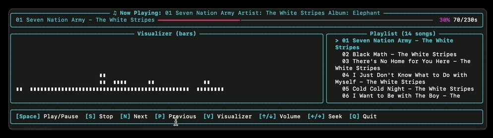

# Terminal Music Player

A visually appealing music player for the macOS terminal with song selection, playback controls, and audio visualization.



## Features

- **Music Library Management**: Scans and organizes your music collection
- **Playback Controls**: Play, pause, stop, next, and previous track functionality
- **Audio Visualization**: Multiple visualization modes (bars, wave, spectrum)
- **Colorful UI**: Rich, colorful terminal interface with panels and borders
- **Metadata Display**: Shows song title, artist, album, and playback progress
- **Keyboard Controls**: Intuitive keyboard shortcuts for all functions

## Requirements

- Python 3.6+
- macOS (primary target, may work on Linux/Windows with limitations)
- Terminal with color support

## Installation

1. Clone the repository:
   ```
   git clone https://github.com/yourusername/terminal-music-player.git
   cd terminal-music-player
   ```

2. Install dependencies:
   ```
   pip install pygame rich numpy scipy mutagen
   ```

## Usage

Run the music player with:

```
python main.py
```

By default, the player will scan your `~/Music` directory for audio files. You can specify a different directory with:

```
python main.py -d /path/to/your/music
```

### Keyboard Controls

- **Space**: Play/Pause
- **S**: Stop
- **N**: Next track
- **P**: Previous track
- **V**: Change visualizer mode
- **↑/↓**: Volume up/down
- **←/→**: Seek (not fully implemented)
- **Q**: Quit

## Supported File Formats

- MP3
- FLAC
- OGG
- WAV

## Project Structure

```
terminal_music_player/
├── main.py           # Entry point
├── player.py         # Audio playback engine
├── ui.py             # Terminal UI components
├── visualizer.py     # Audio visualization
├── library.py        # Music library management
└── utils.py          # Utility functions
```

## How It Works

1. The music library scans the specified directory for audio files and extracts metadata.
2. The player uses pygame to handle audio playback.
3. The visualizer generates visual representations of the audio.
4. The UI coordinates everything and handles user input.

## Limitations

- Seeking within tracks is not fully implemented due to pygame limitations
- Real-time audio analysis for visualization is simulated
- Some terminal emulators may have issues with the UI or keyboard input

## License

MIT License

## Acknowledgements

- [pygame](https://www.pygame.org/) for audio playback
- [rich](https://github.com/Textualize/rich) for terminal UI
- [mutagen](https://mutagen.readthedocs.io/) for audio metadata

## About This Project

このプロジェクトはClineの能力を確かめるために作成されました。一切のコーディングなしで、10分程度で完成しました。モデルはclaude-3-7-sonnet-20250219を使用し、コストはGithubのコミットまで含めて$1程度でした。初期のプロンプトは下記です。
Please create a Music Player that works in the Mac terminal. Make it as visually appealing as possible. It should include song selection, play, stop, next, previous, title display, and visualizer display. The budget is within $3. Please plan with plenty of time including for testing.

Happy coding & Enjoy music!
